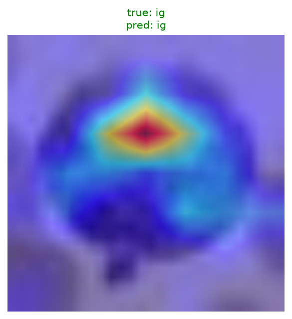
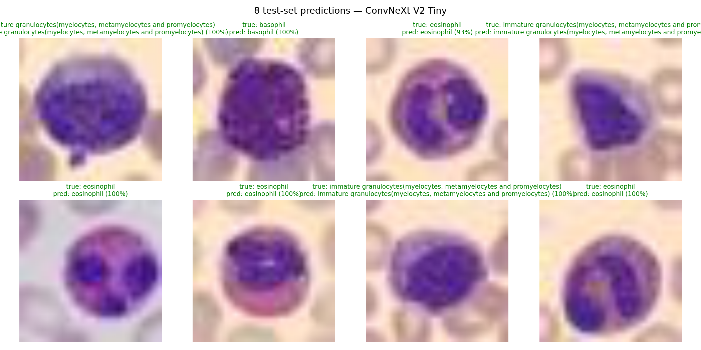

# Blood Cell Classifier 🩸

Fine-grained classification of white/red blood cells from microscopy images, built with
modern transfer learning. Trains and compares two backbones — a modernized CNN
(**ConvNeXt V2**) and a Vision Transformer (**ViT-Small**) — on the **BloodMNIST**
dataset (8 cell types), with a Gradio demo for live inference.

> Part of my computer-vision portfolio. This project focuses on the 2026 fine-tuning
> workflow: pretrained backbones via `timm`, mixed-precision training, experiment
> tracking with W&B, and interpretability with Grad-CAM.

## The 8 classes

`basophil` · `eosinophil` · `erythroblast` · `immature granulocytes (ig)` ·
`lymphocyte` · `monocyte` · `neutrophil` · `platelet`

## What's here

| File | Purpose |
|---|---|
| `cv_project_1_biology_classifier.ipynb` | End-to-end training notebook (data → train ConvNeXt + ViT → Grad-CAM) |
| `app.py` | Gradio demo — both backbones' predictions side by side |
| `model_utils.py` | Shared model loading + preprocessing, used by every script here |
| `eval_test_set.py` | Scores both checkpoints on BloodMNIST's official held-out test split |
| `gradcam_demo.py` | Regenerates the Grad-CAM visualization from the real trained weights |
| `view_predictions.py` | Saves a grid of N random test predictions (image + true/pred + confidence) |
| `gen_notebook.py` | Script that generates the notebook |
| `requirements.txt` | Dependencies |

## Approach

- **Data:** BloodMNIST via the official [`medmnist`](https://medmnist.com/) package, upscaled to 224×224.
- **Models:** `convnextv2_tiny` and `vit_small_patch16_224` from `timm`, pretrained on ImageNet, fine-tuned on blood cells — a direct CNN-vs-transformer comparison.
- **Training:** AdamW, cross-entropy, mixed-precision (`torch.amp`), augmentation (flips + rotations). Metrics logged to Weights & Biases.
- **Interpretability:** Grad-CAM heatmaps to confirm the model attends to the cell, not the background — important for any medical-imaging model.

## Run it

```bash
pip install -r requirements.txt

# 1) Train (best on a GPU — Google Colab or Kaggle). Open the notebook:
#    cv_project_1_biology_classifier.ipynb  -> produces convnextv2_tiny_blood_cells.pth

# 2) Launch the demo (uses the trained .pth):
python app.py
```

## Results

5 epochs, AdamW, mixed precision, on BloodMNIST (train/val split). Full run history and
loss curves are logged to W&B — [ConvNeXt run](https://wandb.ai/akshayanil4-none/cv-sprint-blood-cells/runs/mmyezgvs) ·
[ViT run](https://wandb.ai/akshayanil4-none/cv-sprint-blood-cells/runs/kvfvz0k1).

| Model | Params | Train accuracy | Val accuracy (best epoch) | **Test accuracy** |
|---|---|---|---|---|
| ConvNeXt V2 Tiny | 27.9M | 97.8% | 96.5% (epoch 4) | **96.76%** |
| ViT-Small/16 | 21.7M | 98.1% | 97.3% (epoch 3) | **96.61%** |

Full per-class precision/recall and W&B run history — [ConvNeXt run](https://wandb.ai/akshayanil4-none/cv-sprint-blood-cells/runs/mmyezgvs) ·
[ViT run](https://wandb.ai/akshayanil4-none/cv-sprint-blood-cells/runs/kvfvz0k1) ·
[`eval_test_set.py`](eval_test_set.py) for the held-out test-set scoring script.

**Takeaway:** ViT led on validation (97.3% vs 96.5%), but on the real held-out **test**
split the two are essentially tied, with ConvNeXt nudging slightly ahead (96.76% vs
96.61%) — the val-set ranking didn't hold. That's the actual reason to keep a true
held-out test set separate from validation: val accuracy alone would have pointed at the
wrong "winner" here. With numbers this close (0.15pp apart, well within run-to-run noise
for a 5-epoch fine-tune), the honest conclusion is "roughly equivalent," not "ViT wins" —
ViT's ~6M fewer parameters would be the tiebreaker for a deployment decision.

**Where both models actually struggle** (from the classification report): the hardest
class by far is `ig` (immature granulocytes) — F1 of 0.93 for ConvNeXt, 0.92 for ViT,
noticeably behind every other class (mostly ≥0.97). That's not a modeling failure so much
as a labeling artifact: `ig` lumps together three distinct maturation stages
(myelocytes, metamyelocytes, promyelocytes) into one class, so it's visually
heterogeneous by construction. `monocyte` is the second-hardest (F1 ~0.92), which lines
up with monocyte/lymphocyte being a classically hard pair in hematology microscopy — the
recall pattern (monocyte's precision drops as lymphocyte's recall rises) shows exactly
that confusion in both confusion matrices.

Below: Grad-CAM on an immature granulocyte — the heatmap centers on the cell body itself
rather than background, which is the interpretability bar for any medical-imaging model.
Given `ig` is the hardest class, this is also the most useful place to sanity-check that
the model is looking at the right thing even when it's not always right about *which*
maturation stage.



8 random test-set predictions (ConvNeXt V2 Tiny) — green title = correct, red = wrong:



## Notes

- Model weights (`*.pth`) are gitignored — regenerate them from the notebook.
- Dataset: [BloodMNIST](https://medmnist.com/) (Yang et al., MedMNIST v2).
